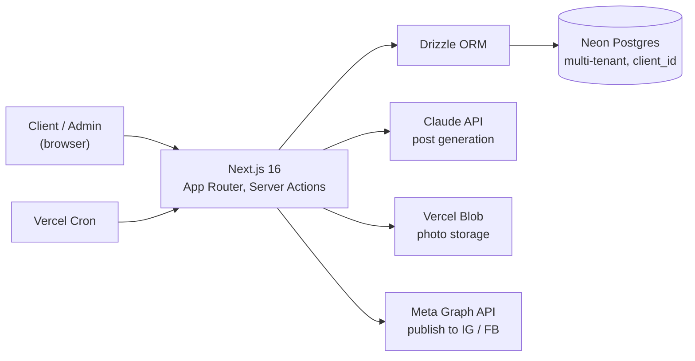
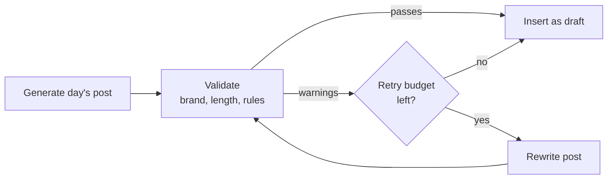

# Postje

[](https://github.com/stefanbogdanmda/postje/actions/workflows/ci.yml)


[](LICENSE)

**Postje is a multi-tenant SaaS that runs social media for small businesses.** Each client gets an isolated account; the platform generates Instagram and Facebook posts with the Claude API, lets clients approve or reject each one, and publishes the approved posts automatically through the Meta Graph API.

Built with Next.js 16 (App Router) and React 19, on a serverless Postgres + Vercel stack.

**[▶ Live demo](https://social-ai-amber.vercel.app)** — passwordless magic-link login. The client-facing UI is in Dutch (v1).

> Status: working application — typecheck, production build, and **406 automated tests** all pass.

---

## What it does

- **AI post generation** — generates on-brand captions per client via the Claude API, with a **self-correcting quality loop** that re-checks and rewrites weak posts before a human ever sees them.
- **Per-post approval workflow** — clients review generated posts one at a time on a weekly rhythm; approvals are per-post, not per-batch.
- **Automated publishing** — approved posts are published to Instagram/Facebook on schedule via the Meta Graph API and Vercel Cron.
- **Passwordless auth** — magic-link sign-in (no passwords), 30-day sessions.
- **Owner dashboard** — a single operator manages many clients, with monitoring and retuning above all accounts.
- **GDPR built in** — per-client data export and deletion are first-class features, with dedicated privacy and terms pages.

## Engineering highlights

These are the things this codebase is deliberately careful about:

- **Multi-tenant isolation** — every row carries a `client_id` and **every query filters by it**; isolation is enforced at the data layer and tested with multiple tenants.
- **Secret hygiene** — no secrets in code or git; Meta API tokens are **encrypted at rest** before being stored.
- **Rate limiting & abuse controls** — persisted rate limiting on sensitive endpoints.
- **Input validation** — request payloads validated with Zod at the boundary.
- **Tested** — 406 tests across 34 files (Vitest), run against an in-memory Postgres (`pglite`) so integration tests exercise real SQL.

## Architecture



**Post generation — the self-correcting quality loop** (`src/lib/ai/post-quality-loop.ts`): each day's post is validated against brand/length/rules and rewritten until it passes or the retry budget runs out, so weak posts are caught before a client ever sees them.



## Tech stack

| Layer | Technology |
|---|---|
| Framework | Next.js 16 (App Router), React 19 |
| Language | TypeScript |
| Database | Neon Postgres + Drizzle ORM |
| Auth | NextAuth v5 (magic links) |
| AI | Anthropic Claude API |
| Email | Resend |
| Storage | Vercel Blob |
| Scheduling | Vercel Cron |
| UI | Tailwind CSS v4 + shadcn/ui |
| Testing | Vitest + pglite |
| Hosting | Vercel |

## Project structure

```
src/
├── app/
│   ├── api/          # route handlers: auth, posts, meta, photos, cron, admin, account
│   ├── admin/        # owner dashboard
│   ├── dashboard/    # client post-approval UI
│   ├── account/      # GDPR export/deletion
│   ├── login/ welcome/ privacy/ terms/
├── lib/
│   ├── ai/           # Claude post generation + self-correcting quality loop
│   ├── auth/         # magic-link sessions
│   ├── meta/         # Meta Graph API publishing + token encryption
│   ├── posts/ photos/ account/ admin/ alerts/ time/
└── db/               # Drizzle schema + migrations
```

## Getting started

```bash
npm install
cp .env.example .env.local   # fill in your own keys (Neon, Anthropic, Resend, Meta, Vercel Blob)
npm run db:migrate           # apply database migrations
npm run dev                  # http://localhost:3000
```

Required environment variables are documented in [`.env.example`](.env.example). No secrets are committed to this repository.

## Scripts

| Command | Purpose |
|---|---|
| `npm run dev` | Start the dev server |
| `npm run build` | Production build |
| `npm test` | Run the full test suite (Vitest) |
| `npm run lint` | Lint the application |
| `npm run db:generate` / `db:migrate` | Generate / apply Drizzle migrations |
| `npm run db:studio` | Open Drizzle Studio |

## Deployment

Deployed on Vercel. The `main` branch is always in a deployable state; every change lands through a reviewed branch.
