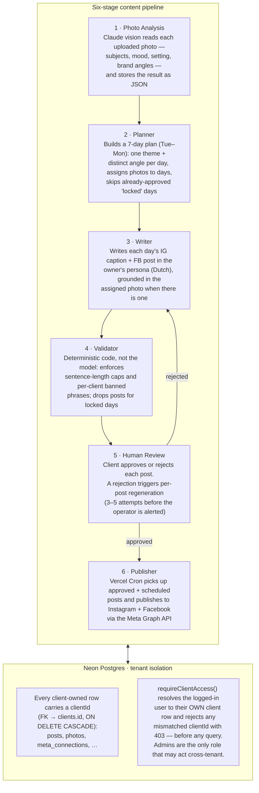

# Social AI

Multi-tenant SaaS that runs social media for hospitality SMBs — cafés, restaurants, small hotels. Each client gets their own account; the system generates a week of Instagram and Facebook posts in the owner's voice, the client approves or rejects each one in a ~5-minute weekly review, and approved posts publish automatically to Meta. One operator runs many clients from a single agency dashboard.

> The product ships under the brand **Postje**. "Social AI" is the project/repo name.

---

## Demo

> _Placeholder — add before sharing._

- **Walkthrough (Loom):** `TODO: paste Loom link`
- **Screenshots:**
  - `docs/screenshots/client-review.png` — client weekly review (approve/reject per post)
  - `docs/screenshots/agency-attention-list.png` — operator attention list
  - `docs/screenshots/generated-week.png` — a generated 7-day plan with photo grounding

---

## Architecture

The core of the product is a **six-stage content pipeline**. It is not an agent framework — it's a sequence of Claude API calls, deterministic validation, a human approval gate, and a scheduled publisher, wired together in Next.js. Each stage has one job and hands structured JSON to the next.

### How tenants stay isolated

Isolation is enforced in the **application layer**, not via database row-level security:

- **Schema:** every client-owned table (`posts`, `photos`, `meta_connections`, deletion requests, …) has a `clientId` column that is a foreign key to `clients.id` with `ON DELETE CASCADE`. Deleting a client removes all of their data atomically.
- **Authorization guard:** `requireClientAccess()` ([`src/lib/authorization.ts`](src/lib/authorization.ts)) maps the authenticated session to the user's single client row. A client requesting any other `clientId` gets a `403` before a query is ever issued. Only the `admin` (operator) role may act across tenants, and even then the target client must exist.
- **Query scoping:** every read and write filters by the resolved `clientId`. There is no "global" data path for client content.

Auth is passwordless **magic links** (NextAuth + Resend); photos live in Vercel Blob with only the URL stored in Postgres.

---

## Stack

| Tech | Why |
| --- | --- |
| **Next.js (App Router)** | One framework for the client UI, the agency dashboard, and the server-side API routes — no separate backend to run. |
| **Neon Postgres + Drizzle ORM** | Serverless Postgres on a free tier that scales; Drizzle gives fully typed, parameterized SQL so tenant-scoping mistakes surface at compile time. |
| **Vercel Cron** | Built-in, free scheduled jobs for publishing due posts, refreshing Meta tokens, and sending operator alerts — no extra workflow service to host. |
| **Anthropic Claude SDK** | Generates the plan and writes the posts; vision reads the photos. The "feels human" quality is the product, so model quality is load-bearing. |
| **TypeScript** | The whole codebase is multi-tenant; types catch wrong-shape data and missing `clientId` before runtime. |
| **Vitest** | Fast unit tests around the parts that must not break — authorization, validation, publishing, GDPR deletion. ~33 test files gate the risky logic. |

---

## How it was built

Designed and shipped **with Claude Code**. My role was architecture, product decisions, and verification — not typing every line.

The work ran on a strict, repeatable loop (the project's "Superpowers" workflow, captured in [`docs/superpowers/`](docs/superpowers/)):

**brainstorm → write a plan → execute the plan → verify.**

Concretely, that meant:

- **Architecture & product decisions are mine.** The spec ([`docs/social-ai-spec.md`](docs/social-ai-spec.md)) and the conventions in [`CLAUDE.md`](CLAUDE.md) — multi-tenancy rules, the human-in-the-loop approval model, the "feels human" levers, the choice of Neon over a heavier stack and Vercel Cron over n8n — were decided up front and written in plain English before any code.
- **Plan mode before code.** Each feature has a design doc and a plan in `docs/superpowers/specs/` and `docs/superpowers/plans/` (magic-link auth, post generation, the publisher engine, GDPR export/deletion, and more) that were reviewed before implementation started.
- **Verification, not vibes.** Tests gate the dangerous parts (authorization, post validation, Meta publishing, account deletion); review loops and handoff documents ([`docs/handoffs/`](docs/handoffs/)) kept context intact across sessions.

---

## Status

- **2 pilot tenants live** (hospitality) — generating and reviewing real weekly content.
- **Meta publishing integration in progress** — OAuth connection, token encryption/refresh, and the publish path are built; final Meta app review is the remaining blocker before fully automated publishing.

---

## Roadmap

- **Brand-voice website scanner** — derive a client's tone, offerings, and banned phrases automatically from their existing website, reducing onboarding to minutes.
- **Analytics feedback loop** — pull post-level engagement from Meta and feed it back into planning and posting-time decisions, so the system tunes itself per client over time.
